py# Math Behind Fortnite Shrinking Circle

I've been playing a lot of Fortnite OG, and it got me wondering how exactly the "storm" circle shrinks into the non-concentric "safe" circle. The math behind it is actually extremely simple.

 Credit: *echogear.com*

## Definition of Circles
Circles have 2 basic properties: a center point , and a radius 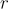.

For simplicity sake, let's assume there is a predefined circle 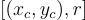 (Not proper mathematical notation, but it will simplify writing.)

The new, smaller circle is defined as such  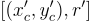, where 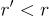. 

## Randomly Selecting New Center Point
To ensure the smaller circle is inside the larger one, we use this constraint:

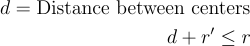

or

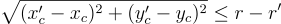

The new center 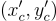 can be randomly chosen in this region.

Now, we can generate a random radius and its center.

1. Generate a random angle 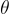 such that 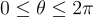
2. Generate a random radius d:  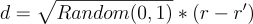
3. Calculate the new center as 
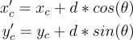

## Shrinking into the Smaller Circle
To shrink the circle, we can use a technique called linear interpolation.

For 2 points 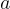 (start) and 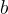 (end value), it can be shrunk using the following formula:

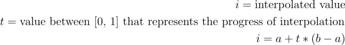

So, 
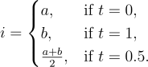

Applying this to our circle definition gives us:

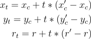

Specifically for Fortnite, 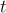 can be represented as 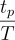 where 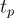 is time passed in shrinking phase, and $T$ is total length of the phase.

## Desmos Animation
A sample animation & implemented math can be found in this Desmos calculation.
<iframe src="https://www.desmos.com/calculator/ssxsw7jhbv?embed" width="500" height="500" style="border: 1px solid #ccc" frameborder=0></iframe>

This same shrinking math also works for the "new" storms where at endgame, the inner circle may be placed inside the current storm.
<iframe src="https://www.desmos.com/calculator/dvxrdyeqou?embed" width="500" height="500" style="border: 1px solid #ccc" frameborder=0></iframe>

## Conclusion
Epic Games may use a different formula than this, but it's what I found first and the animation looks very similar.

[Desmos Calculator](https://www.desmos.com/calculator/uzgt6jsagu)